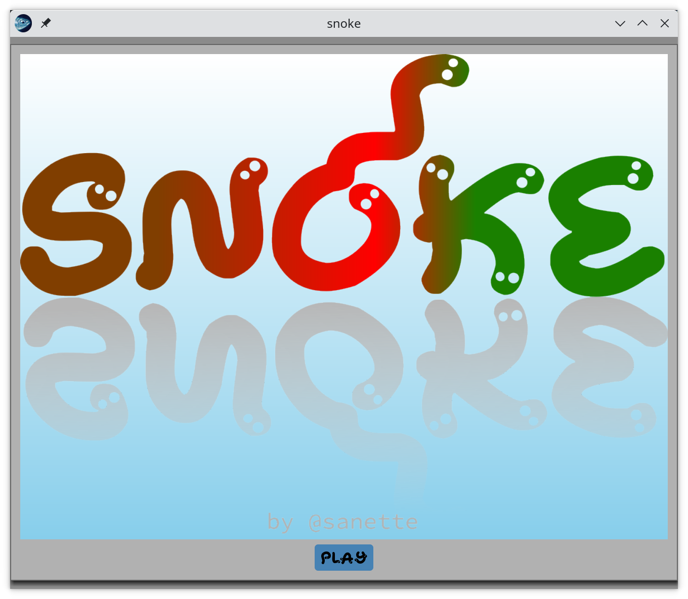
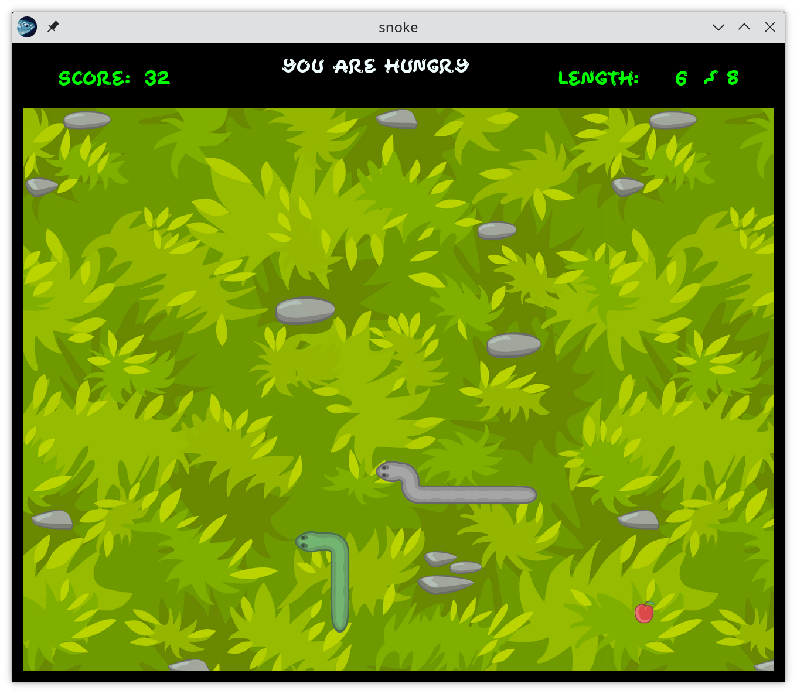

# Snóke, old snake game with new ideas



## The rules of the game

The game has several levels to complete. The goal is simple: find the
snake **shed skin**, eat the exact amount of **fruit** to reach the size of
that skin, and **cover** it precisely.

* You **lose** if you eat to much, bump into the area border, or into
  yourself

* **Bananas** make you move faster (except when you reach your target
  size)

* You get **bonus points** if you eat the next fruit with an *optimal path*!

## Screenshots



(v0.1)

## Video

https://youtu.be/h1MC9-xDKFA

(v0.1)

## Install

### Binaries

If you're lucky, you may just download one of the precompiled binaries of the [latest release](https://github.com/sanette/snoke/releases/latest), or one of the latest [automatic builds](https://github.com/sanette/snoke/tree/main/binaries) (ubuntu and macos).
You will need to have the SDL2 library installed on your system.

### From source

It's also easy to build Snóke from source, and it will take care of
all dependencies. This requires `ocaml`, and the `opam` package
manager.

Just do:
```
opam pin add https://github.com/sanette/snoke.git
opam install snoke
```

Or, download or clone this repo, `cd` into the `snoke` dir, and
```
opam install .
```

Then you should be able to launch the game with
```
snoke
```

Alternatively, instead of the install step, you can directly run the game with
```
cd src
dune exec ./snoke.exe
```

## How did you make such a wonderful and entertaining game?

First of all, it's written is `ocaml` which makes it fun to code!
While `ocaml` is not particularly known for games, I came across this
[nice blog article](http://decapode314.free.fr/re/tut/ocaml-re-tut.html)
by Florent Monnier and realized it would make a good challenge for
testing the GUI library
[Bogue](http://sanette.github.io/bogue/Principles.html).

You can read [here](https://github.com/sanette/snake-bogue) how it all
started.

## TODO

* (v0.3) First opam package.
* **DONE** (v0.2) ~~The snake should have 3 lives before game over~~
* **DONE** (v0.2-halloween-wink) ~~Eat pumkins!~~
* More levels
* High-scores list
* More fruit with effects
* Background music(?)
